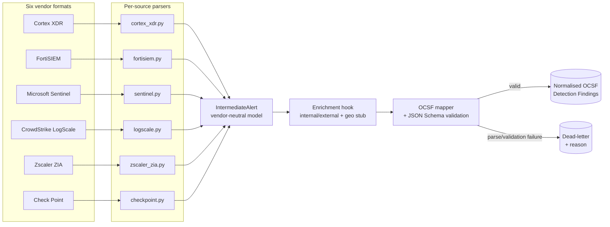

# siem-to-ocsf

Normalise security alerts from six SIEM/vendor formats into a single
[OCSF](https://schema.ocsf.io) schema so heterogeneous detections can be correlated on
one common model.

Every SIEM and security product emits alerts in its own shape — different field names,
different severity scales, different nesting. That makes cross-tool correlation painful:
a "high" in one tool is a `9` in another and a `riskscore: 88` in a third, and the same
host is `host_name` here, `ComputerName` there, and an `Entities[]` array somewhere else.
The [Open Cybersecurity Schema Framework (OCSF)](https://schema.ocsf.io) solves this by
defining a vendor-neutral event model — the same approach
[AWS Security Lake](https://docs.aws.amazon.com/security-lake/latest/userguide/open-cybersecurity-schema-framework.html)
uses. This tool is a focused, readable implementation of that normalisation layer: it
maps Cortex XDR, FortiSIEM, Microsoft Sentinel, CrowdStrike LogScale, Zscaler ZIA, and
Check Point alerts onto the OCSF **Detection Finding** class and validates every output
against the official schema.

> **All sample data in this repository is synthetic and fabricated for demonstration.**
> No real logs, hosts, users, or organisations are represented. IP addresses use the
> RFC 5737 (`192.0.2.0/24`, `198.51.100.0/24`, `203.0.113.0/24`) and RFC 1918 ranges;
> domains use `.example` / `.invalid`. There are no secrets or credentials anywhere.

## Pinned schema version

OCSF **1.8.0** (latest stable, released 2026-03-18). The official Detection Finding JSON
Schema is vendored at
[`src/siem_to_ocsf/schema/detection_finding-1.8.0.schema.json`](src/siem_to_ocsf/schema/detection_finding-1.8.0.schema.json)
and is the authoritative validator — see
[`schema/PROVENANCE.md`](src/siem_to_ocsf/schema/PROVENANCE.md) for exactly how it was
obtained. Browse the class online: https://schema.ocsf.io/1.8.0/classes/detection_finding

| OCSF identifier | Value |
|---|---|
| `class_uid` | `2004` (Detection Finding) |
| `category_uid` | `2` (Findings) |
| `type_uid` | `200401` (`class_uid*100 + activity_id`, Create) |
| `metadata.version` | `1.8.0` |

## Architecture



The design keeps **adding a new source to writing one parser**. A parser's only job is to
produce an `IntermediateAlert`; the mapper, validator, enrichment, dead-lettering, and
summary are all shared and source-agnostic.

## Quickstart

Requires Python 3.12 (developed on macOS / Apple Silicon).

```bash
# 1. Clone and create a virtual environment
git clone https://github.com/sai-teja-girimaji/siem-to-ocsf.git
cd siem-to-ocsf
python3.12 -m venv .venv
source .venv/bin/activate

# 2. Install (editable, with dev tools)
pip install -e ".[dev]"

# 3. Normalise the bundled synthetic samples (auto-detecting each source)
siem-to-ocsf samples/ --source auto --out out/ocsf.jsonl
```

Expected output:

```
Wrote 18 OCSF events -> out/ocsf.jsonl
Wrote 2 dead-lettered records -> out/ocsf.jsonl.deadletter.jsonl

+-------------+----+------+------+----------+-----------+
| Source      | In | OCSF | Dead | Raw flds | OCSF flds |
+-------------+----+------+------+----------+-----------+
| checkpoint  |  3 |    3 |    0 |       18 |        23 |
| cortex_xdr  |  4 |    3 |    1 |       18 |        22 |
| fortisiem   |  3 |    3 |    0 |       19 |        22 |
| logscale    |  3 |    3 |    0 |       17 |        22 |
| sentinel    |  3 |    3 |    0 |       14 |        21 |
| unknown     |  1 |    0 |    1 |        - |         - |
| zscaler_zia |  3 |    3 |    0 |       18 |        22 |
+-------------+----+------+------+----------+-----------+
| TOTAL       | 20 |   18 |    2 |          |           |
+-------------+----+------+------+----------+-----------+

Before/after: ~17 heterogeneous vendor fields per alert  ->  ~22 fields on one OCSF Detection Finding model (75 fields available in OCSF 1.8.0).
Dead-letter reasons: KeyError x1, unable to auto-detect source x1
```

(The `cortex_xdr` "In=4 / Dead=1" and the `unknown` row come from the two intentionally
broken records in [`samples/malformed/`](samples/malformed) — they demonstrate that one
bad record never aborts the run.)

### CLI reference

```
siem-to-ocsf INPUT [--source {auto,cortex_xdr,fortisiem,sentinel,logscale,zscaler_zia,checkpoint}]
                   [--out PATH] [--format {jsonl,array}]
                   [--deadletter PATH] [--validate-only] [--no-enrich]
```

- `INPUT` — a `.json` file or a directory searched recursively. Files may be a single
  object, a JSON array, or JSONL.
- `--source auto` (default) detects the vendor per record from signature fields.
- `--validate-only` parses, maps and validates but writes no output (CI gate / dry run).
- Dead letters default to `<out>.deadletter.jsonl`.

## Before / after

A raw Cortex XDR alert (`samples/cortex_xdr/alert_powershell_download.json`):

```json
{
  "alert_id": "CRTX-100481",
  "name": "Suspicious PowerShell download cradle",
  "category": "Malware",
  "severity": "high",
  "detection_timestamp": 1779974400000,
  "host_name": "FIN-WS-014",
  "user_name": "acme\\j.harper",
  "action_local_ip": "10.20.14.37",
  "action_local_port": 50231,
  "action_remote_ip": "203.0.113.45",
  "action_remote_port": 443,
  "action_file_sha256": "9f2c4e6a...8f0a",
  "mitre_tactic_id_and_name": "TA0002 - Execution",
  "mitre_technique_id_and_name": "T1059.001 - PowerShell"
}
```

…becomes a validated OCSF Detection Finding (abridged):

```json
{
  "class_uid": 2004, "class_name": "Detection Finding",
  "category_uid": 2, "category_name": "Findings",
  "activity_id": 1, "type_uid": 200401,
  "time": 1779974400000, "time_dt": "2026-05-28T13:20:00Z",
  "severity_id": 4, "severity": "High",
  "status_id": 1, "status": "New",
  "metadata": {
    "version": "1.8.0",
    "product": { "vendor_name": "Palo Alto Networks", "name": "Cortex XDR" }
  },
  "finding_info": {
    "uid": "CRTX-100481",
    "title": "Suspicious PowerShell download cradle",
    "types": ["Malware"],
    "attacks": [{ "technique": {"uid": "T1059.001", "name": "PowerShell"},
                  "tactic": {"uid": "TA0002", "name": "Execution"} }]
  },
  "observables": [
    {"name": "IP Address", "type_id": 2, "value": "10.20.14.37"},
    {"name": "IP Address", "type_id": 2, "value": "203.0.113.45"},
    {"name": "Hostname",   "type_id": 1, "value": "FIN-WS-014"},
    {"name": "User Name",  "type_id": 4, "value": "acme\\j.harper"},
    {"name": "SHA-256",    "type_id": 8, "value": "9f2c4e6a...8f0a"}
  ],
  "evidences": [{
    "src_endpoint": {"ip": "10.20.14.37", "port": 50231},
    "dst_endpoint": {"ip": "203.0.113.45", "port": 443}
  }],
  "enrichments": [
    {"name": "ip_scope", "value": "internal", "data": {"ip": "10.20.14.37", "role": "src_endpoint", "scope": "internal"}},
    {"name": "ip_scope", "value": "external", "data": {"ip": "203.0.113.45", "role": "dst_endpoint", "scope": "external", "geo": {"country": "ZZ", "asn": "AS64500", "note": "synthetic"}}}
  ]
}
```

The full per-field and per-severity mapping for every vendor is in
[`MAPPING.md`](MAPPING.md).

## Supported sources

| Source | `--source` key | Vendor / product | Native severity |
|---|---|---|---|
| Palo Alto Cortex XDR | `cortex_xdr` | Palo Alto Networks / Cortex XDR | text (info…critical) |
| Fortinet FortiSIEM | `fortisiem` | Fortinet / FortiSIEM | numeric 0–10 |
| Microsoft Sentinel | `sentinel` | Microsoft / Microsoft Sentinel | text (Info…High) |
| CrowdStrike LogScale | `logscale` | CrowdStrike / Falcon LogScale | numeric 0–100 |
| Zscaler Internet Access | `zscaler_zia` | Zscaler / Zscaler Internet Access | `riskscore` 0–100 |
| Check Point | `checkpoint` | Check Point / (blade name) | text (Info…Critical) |

## Operational-realism features

- **Data-quality handling / dead-letter queue.** Any record that fails to load, parse, or
  validate is routed to a dead-letter file with a reason and origin — the run never
  crashes. See [`pipeline.py`](src/siem_to_ocsf/pipeline.py).
- **Enrichment hook.** [`enrichment.py`](src/siem_to_ocsf/enrichment.py) is the seam where
  identity / asset / geo / threat-intel context attaches at ingestion. A working synthetic
  example tags each endpoint IP internal vs external and attaches a geo/ASN stub for
  external addresses, emitted as OCSF `enrichments[]`.
- **Run summary.** Counts per source, totals normalised vs dead-lettered, field-coverage
  stats, and a screenshot-friendly before/after of vendor field count vs the unified OCSF
  model.

## Project structure

```
siem-to-ocsf/
  src/siem_to_ocsf/
    cli.py            # argparse CLI + summary table
    pipeline.py       # load -> detect -> parse -> enrich -> map -> validate (resilient)
    models.py         # intermediate model + OCSF models (pydantic) + OCSF enums
    ocsf.py           # OCSF mapping, pinned constants, JSON Schema validation
    enrichment.py     # enrichment hook (internal/external + geo stub)
    parsers/          # one module per source (+ registry, shared helpers)
    schema/           # vendored official OCSF 1.8.0 Detection Finding JSON Schema
  samples/            # synthetic raw alerts, per vendor (+ malformed/ for the DLQ demo)
  tests/              # parser unit tests, golden-file mapping tests, schema validation
  MAPPING.md          # per-vendor field + severity mapping tables
```

## Development

```bash
ruff check .        # lint
pytest              # parser, golden-file, and schema-validation tests

# Regenerate golden files after an intentional mapping change:
SIEM_TO_OCSF_REGEN=1 pytest tests/test_ocsf_mapping.py
```

The test suite covers: every parser (raw → intermediate model), golden-file OCSF output
for one alert per vendor, that **every** normalised event validates against the pinned
OCSF schema, and the dead-letter / enrichment / CLI behaviour.

## Notes & scope

- All six sources map to OCSF **Detection Finding**. A network-oriented second mapping
  (Zscaler → Network Activity, `class_uid 4001`) and a standalone coverage-scoring report
  are noted as future work.
- This is a demonstration of the normalisation layer, not a turnkey ingestion product:
  the parsers cover the characteristic fields of each format, not every optional field.

## License

[MIT](LICENSE).
